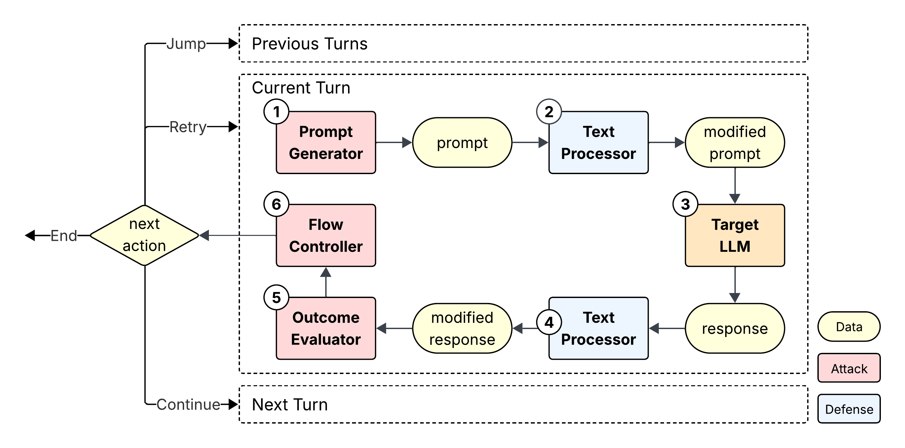

# Developer Guide

## Terminology

### Turn

A **turn** is one round of interaction with the target model within a multi-turn attack. Conceptually, it consists of one prompt (commonly known as user message) + one response (commonly known as assistant message) within a conversation.


### Attempt

Some multi-turn attacks involve retrying a turn if they are not satisfied with the target model's output. In this framework, such retries are referred to as **attempts**.

A single turn may contain multiple attempts, but only one attempt is considered **in-effect**. Data generated within the in-effect attempt (such as attack prompt, model response, and evaluation results) is carried forward to subsequent turns. By default, the framework always treats the latest attempt within a turn in-effect, but this can be changed through special control flow actions (see later section).

### Epoch

Each attempt is assigned an **epoch** number, which records the chronological order of attempts. Epoch values start at 1 and increase monotonically. Each attempt can be uniquely identified by its epoch number.

### Attack Context

[**Attack Context**](../engine/core/context.py) is a data class that aggregates all data generated throughout a multi-turn attack. Such design enables uniform attack/defense interfaces that always accept an attack context as the only parameter.

Besides some metadata, the attack context maintains both a **full history** and a **running history**:

- **Full history** records every attempt in chronological order.
- **Running history** reflects the effective execution path, incorporating control-flow actions such as `retry` and `jump_to`.

## System Design



In each attempt, the framework executes the following steps:

1. Attacker generates an attack prompt
2. Defenser (if enabled) pre-processes the prompt
3. Target model produces a response
4. Defenser (if enabled) post-processes the response
5. Attacker evaluate the outcome
6. Attacker decides the next action

## Control Flow

### Actions For Attackers

MT-JailBench provides flexible control-flow actions that determine how the attack progresses.

- **CONTINUE (optional param: epoch)**  
  Proceed to the next turn. Optionally, a specific attempt may be designated as in-effect for this turn (by referencing its epoch number). This is useful when a previous attempt is more favorable than the current one. If no optional parameter is specified, the last attempt is treated as in-effect

- **RETRY**  
  Retry the current turn. This creates a new attempt under the same turn.

- **JUMP_TO (required param: turn)**  
  Jump back to a previous turn. This clears all attempts associated with that turn (and subsequent turns) from the **running history**, while preserving them in the **full history** for traceability.

- **END_SUCCESS**  
  Terminate the attack with a success signal.

- **END_FAILURE**  
  Terminate the attack with a failure signal.

### Termination Conditions

An attack may terminate under one of the following conditions, each associated with a termination code:

- **SUCCESS_BY_SELF_EVAL**  
  The evaluator determines that the jailbreak has succeeded.

- **FAILURE_BY_SELF_EVAL**  
  The evaluator determines that the jailbreak has failed.

- **MAX_TURN_REACHED**  
  The attack attempts to continue beyond the configured `max_turns` limit.

- **MAX_EPOCH_REACHED**  
  The attack attempts to continue beyond the configured `max_epochs` limit.

### Illustrative Example

Below is an illustrative example of how full history and running history diverge under different control-flow actions.

Suppose the attacker makes the following control flow decisions:

| Epoch | Turn & Attempt | Action |
|-------|---------------|--------|
| 1 | T1 A1 | RETRY |
| 2 | T1 A2 | CONTINUE(epoch=1) |
| 3 | T2 A1 | CONTINUE |
| 4 | T3 A1 | JUMP_TO(turn=T1) |
| 5 | T1 A1 | CONTINUE |
| 6 | T2 A1 | CONTINUE |
| 7 | T3 A1 | END_SUCCESS |

The **full history** records all attempts exactly as shown in the table above.

---

#### Running History After Epoch 3

```
- Turn 1
    - Attempt 1 (epoch=1) -> in-effect  
    - Attempt 2 (epoch=2)
- Turn 2
    - Attempt 1 (epoch=3) -> in-effect
```

*Explanation: `CONTINUE(epoch=1)` designated epoch 1 as in-effect for turn 1.*

---

#### Running History After Epoch 4

```
(empty)
```

*Explanation: `JUMP_TO(turn=1)` cleared the running history within and after turn 1 (effectively restarting the entire conversation).*

---

#### Running History After Epoch 7

```
- Turn 1
    - Attempt 1 (epoch=5) -> in-effect
- Turn 2
    - Attempt 1 (epoch=6) -> in-effect
- Turn 3
    - Attempt 1 (epoch=7) -> in-effect
```

*Explanation: attack progressed linearly after epoch 4.*